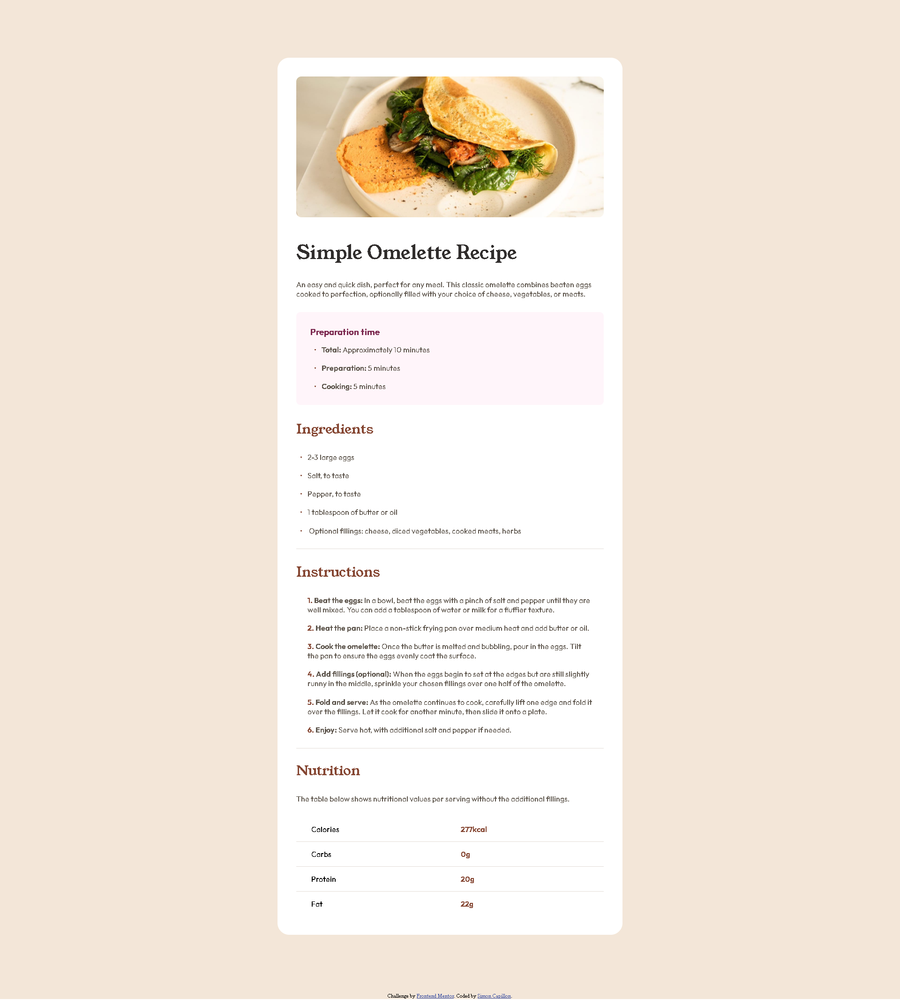

# Frontend Mentor - Recipe page solution

This is a solution to the [Recipe page challenge on Frontend Mentor](https://www.frontendmentor.io/challenges/recipe-page-KiTsR8QQKm). Frontend Mentor challenges help you improve your coding skills by building realistic projects. 

## Table of contents

- [Overview](#overview)
  - [The challenge](#the-challenge)
  - [Screenshot](#screenshot)
  - [Links](#links)
- [My process](#my-process)
  - [Built with](#built-with)
  - [What I learned](#what-i-learned)
  - [Useful resources](#useful-resources)
- [Author](#author)

## Overview

### Screenshot



### Links

- Solution URL: [https://github.com/simon7195/Recipe-Page-Frontend-Mentor]
- Live Site URL: [https://recipe-page-frontend-mentor-gamma.vercel.app/]

## My process

### Built with

- Semantic HTML5 markup
- CSS custom properties

### What I learned

I learned to personnalize list pins and numbers.

```css
ol li:before {
	content: counter(item) ". ";
	counter-increment: item;
	color: var(--color-brown-800);
	font-weight: 700;
}
ul li::before {
	content: "•";
	color: var(--color-brown-800);
	display: inline-block;
	font-size: 1rem;
	width: 1rem;
	margin-left: -1em;
}
```

### Useful resources

- [How to personnalize pins and numbers for your list](https://www.w3.org/Style/Examples/007/color-bullets.en.html)

## Author

- Website - [Simon Capillon](https://www.your-site.com)
- Frontend Mentor - [@simon7195](https://www.frontendmentor.io/profile/simon7195)
